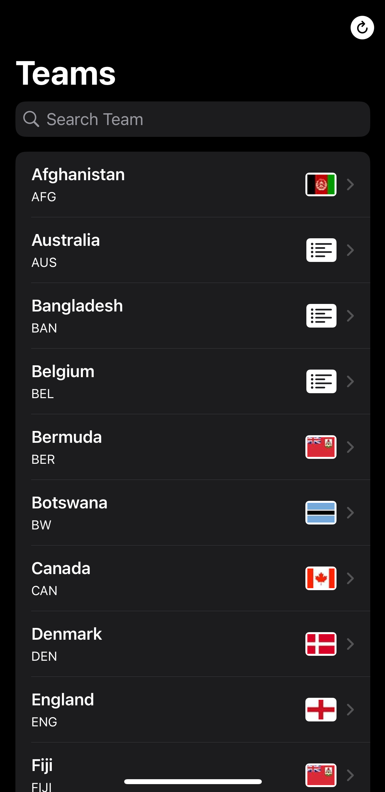
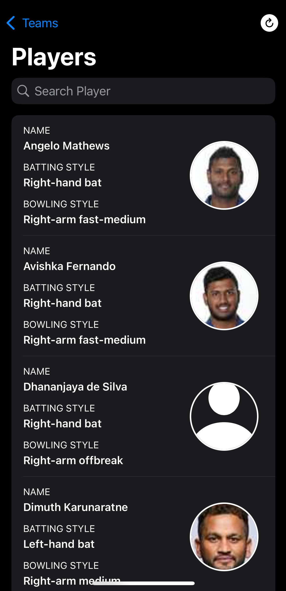

# Cricapp
> This app provides data on international cricket teams and the players of each team.

<br>
<p align="center">
   &nbsp;&nbsp;&nbsp;&nbsp;&nbsp;
  
</p>
<br>

in the APIModel file, update the key with your API Key in [Rapid](https://rapidapi.com/).
```
struct APIModel {
    static private let key: String = "YOUR API KEY"
}
```
